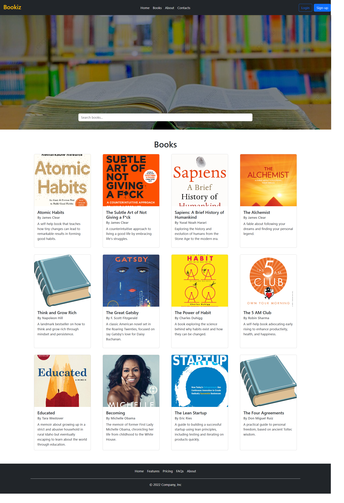

# 📚 Book Issuing System

This is a **MERN stack** application where users can log in, view books, and issue books by selecting the issue and return dates. It implements user authentication using **JWT (JSON Web Token)** for secure access.

## 🛠 Tools and Technologies Used

### Frontend
- **React.js**: A JavaScript library for building user interfaces, used for handling the frontend of the application.
- **HTML5**: Markup language used to structure web content.
- **CSS3**: Stylesheet language used to design the appearance of the application.
- **Bootstrap**: A popular CSS framework for building responsive and mobile-first websites.

### Backend
- **Node.js**: JavaScript runtime for executing JavaScript code on the server side.
- **Express.js**: A web framework for Node.js, used for creating RESTful APIs and handling HTTP requests.

### Database
- **MongoDB**: A NoSQL database used for storing user information and book data.

### Authentication
- **JWT (JSON Web Token)**: Used for securely transmitting information between frontend and backend. A token is generated upon successful login to authenticate users for further requests.

## ✨ Features

- **User Authentication**: Users can log in with their email and password. A JWT token is generated upon successful login and stored in localStorage for secure authentication.
- **Book Management**: 
  - View details of available books, including book name, author, description, and cover image.
  - Issue a book by selecting an issue date and a return date (dates cannot be earlier than the current date).
- **Responsive Design**: The application is fully responsive, ensuring a good user experience on both desktop and mobile devices.

## Home page

